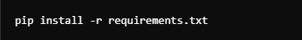

# **RetroVerse**

Esse projeto é feito com o intuito de aprender as técnicas da disciplina de gerência de projetos.

## Como usar

### Configurando os pacotes:
- Crie um ambiente virtual na pasta do seu diretório: 

- Depois ative ele com o comando(Windows): 

- Agora, só instalar as dependências do arquivo requiriments.txt: 

### Banco de dados utilizado
- Foi utilizado o mysql como banco de dados.
- Para fazer a integração com python, se usou a biblioteca sequelize.

### Rodando o programa
- No terminal, para rodar o programa, se utiliza o comando:
~~~python
flask --app server run --debug
~~~